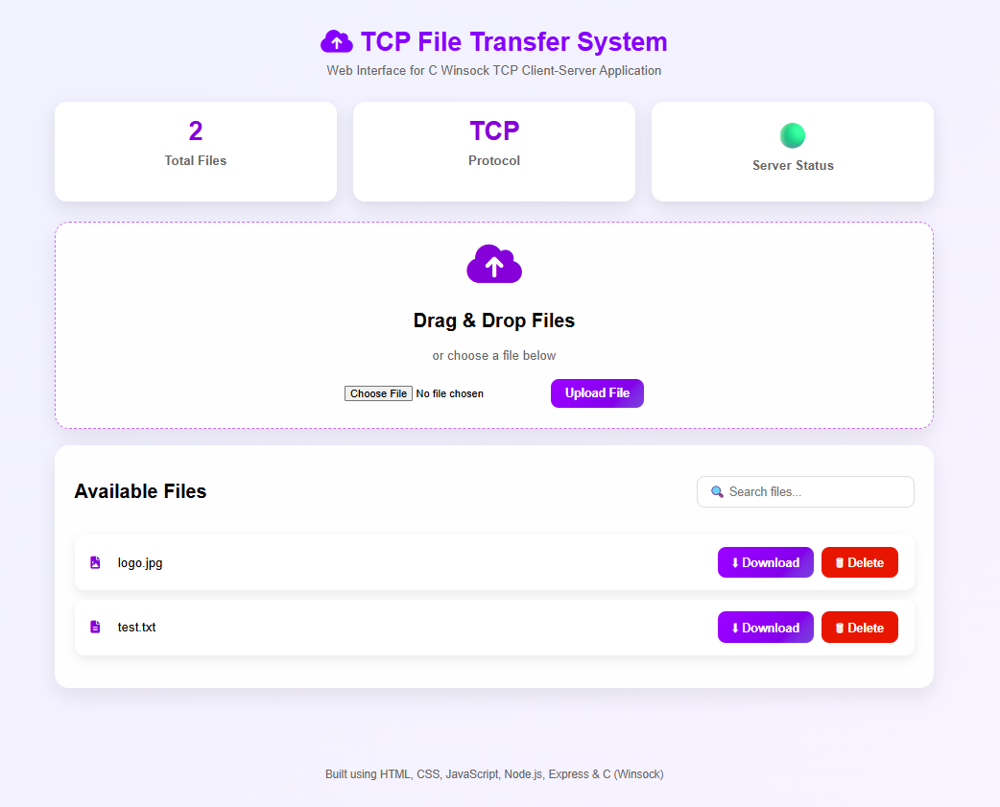

# 📁 TCP File Transfer System with Web Dashboard

A full-stack TCP File Transfer System built using **C (Winsock)** for socket communication and enhanced with a **Node.js + Express** web dashboard. The application allows users to upload, download, view, and delete files through an intuitive browser interface.

---

## 🚀 Live Demo

🔗 https://tcp-file-transfer-system.onrender.com

## 💻 GitHub Repository

🔗 https://github.com/Harshitha2866/tcp-file-transfer-system-c

---

## ✨ Features

- 📤 Upload files through a web interface
- 📥 Download uploaded files
- 📂 View all available files
- 🗑 Delete files
- 📊 Displays total uploaded files
- 🔍 Search uploaded files
- 🌐 Browser-based dashboard
- ⚡ TCP Socket Programming using Winsock
- 🔗 REST API integration with Express.js

---

## 🛠 Tech Stack

### Backend
- C
- Winsock
- TCP Socket Programming
- Node.js
- Express.js
- Multer

### Frontend
- HTML5
- CSS3
- JavaScript
- Font Awesome

### Deployment
- Render

---

## 📷 Screenshots

### Dashboard

> Add a screenshot here after uploading it.

```md

```

---

## 📂 Project Structure

```
TCP File Transfer System
│
├── client/
│   ├── index.html
│   ├── style.css
│   └── script.js
│
├── server/
│   ├── server.js
│   ├── package.json
│   └── package-lock.json
│
├── uploads/
│
├── client.c
├── server.c
└── README.md
```

---

## ⚙️ Installation

### Clone Repository

```bash
git clone https://github.com/Harshitha2866/tcp-file-transfer-system-c.git
```

### Install Dependencies

```bash
cd server
npm install
```

### Start Server

```bash
npm start
```

Open

```
http://localhost:3000
```

---

## 📌 Future Enhancements

- User Authentication
- Drag & Drop Upload Progress
- Multiple File Upload
- File Size Restrictions
- Dark Mode
- Cloud Storage Integration

---

## 👩‍💻 Author

**Harshitha Minnikanti**

- GitHub: https://github.com/Harshitha2866
- LinkedIn: *https://www.linkedin.com/in/harshitha-minnikanti-24a682354/*
